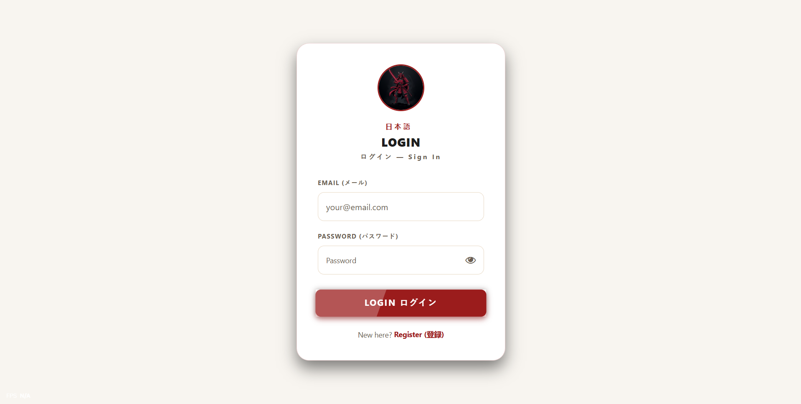

<div align="center">
  
  <h1>🌸 Nihongo Learning Platform 🌸</h1>
  <p><em>A comprehensive, production-ready Japanese language learning platform.</em></p>

  [](https://reactnative.dev/)
  [](https://expo.dev/)
  [](https://nodejs.org/)
  [](https://expressjs.com/)
  [](https://www.mongodb.com/)
</div>

<br />

> **The platform provides a dynamic and engaging environment for students to master Japanese vocabulary and Kanji specifically targeted at the JLPT (Japanese Language Proficiency Test) levels N5 to N1.**

---

## 🌟 Overview

The **Nihongo Learning Platform** combines a beautifully crafted mobile-first interface with a powerful administrative backend. It features an integrated JLPT curriculum, dynamic quizzes, real-time AI assistance, and an administrative dashboard for full control over content distribution. The project is fully configured for cloud deployment on Railway and APK distribution via Expo Application Services (EAS).

---

## ✨ Key Features

- 📚 **JLPT Learning System**: Structured progression tracks for Kanji and Vocabulary spanning all JLPT levels (N5-N1).
- ⚙️ **Admin Dashboard**: A secure management interface allowing administrators to instantly upload, reorder, and delete educational videos with fully optimistic UI updates.
- 🎯 **Dynamic Quizzes**: Auto-evaluating assessments that unlock sequential learning modules upon successful completion.
- 🤖 **AI Chatbot Integration**: A responsive AI tutor built on the Groq API to provide students with instant Japanese language guidance and explanations.
- 📜 **Certificates System**: Automated generation of completion certificates for successfully mastering specific JLPT tiers.
- 🔒 **Secure Authentication**: Robust JWT-based authentication system supporting role-based access control (Admin vs. Student).
- 🌙 **Dark Mode**: Fully adaptive responsive UI with custom dynamic theme support.

---

## 🛠 Technologies Used

### Frontend 📱
- **React Native & Expo SDK 54**: For cross-platform mobile application development.
- **TypeScript**: Ensuring type safety and scalable code architecture.
- **Axios**: For robust API communication and interceptor-based token management.

### Backend 🖥️
- **Node.js & Express.js**: Providing a high-performance RESTful API backend.
- **MongoDB Atlas**: Cloud-hosted NoSQL database for secure, scalable data persistence.
- **Mongoose**: For structured schema enforcement and optimized query building.
- **JWT Authentication**: Enabling secure, stateless session management.
- **Groq AI**: Powering the integrated conversational AI tutor.
- **Cloudinary**: Robust cloud media storage pipeline for persistent video streaming.

### Cloud & Deployment ☁️
- **Railway**: Continuous integration and deployment pipeline for the Express backend.
- **EAS (Expo Application Services)**: Cloud-native APK build generation.

---

## 🏗 Architecture Overview

The system follows a standard decoupled Client-Server architecture:
1. **Client Layer**: The React Native Expo application provides the interface. It securely manages JWT tokens in local storage and interacts with the API layer via strictly typed Axios endpoints.
2. **API Layer**: The Express.js backend acts as the central router, verifying tokens, executing business logic (such as quiz validation and video order normalization), and communicating with external AI services.
3. **Data Layer**: MongoDB Atlas maintains all persistent state, utilizing compound indexes to ensure fast document retrieval and atomic batch operations for bulk state updates.

---

## 📸 Screenshots

<div align="center">
  <table>
    <tr>
      <th align="center">Login</th>
      <th align="center">Admin Dashboard</th>
      <th align="center">Student Dashboard</th>
    </tr>
    <tr>
      <td align="center"></td>
      <td align="center"></td>
      <td align="center"></td>
    </tr>
  </table>
</div>

---

## 🚀 Setup Instructions

### Prerequisites
- Node.js (v18+)
- MongoDB Atlas account (or local MongoDB instance)
- Groq API Key

### Backend Setup
1. Navigate to the backend directory:
   ```bash
   cd backend
   ```
2. Install dependencies:
   ```bash
   npm install
   ```
3. Create a `.env` file based on `.env.example` (ensure you set `MONGO_URI`, `JWT_SECRET`, and `GROQ_API_KEY`).
4. Start the server:
   ```bash
   npm start
   ```

### Frontend Setup
1. Navigate to the frontend directory:
   ```bash
   cd frontend
   ```
2. Install dependencies:
   ```bash
   npm install
   ```
3. Update the `API_URL` in `context/AuthContext.tsx` to point to your backend.
4. Start the Expo development server:
   ```bash
   npm start
   ```

---

## ☁️ Cloud Deployment

### Railway Deployment (Backend)
The backend is fully configured for immediate deployment via Railway. 
Simply connect this repository to a new Railway project and specify `/backend` as the Root Directory. Railway will automatically install dependencies and launch the server using the configuration specified in `backend/package.json`.

### EAS APK Build (Frontend)
To generate a production-ready Android APK:
1. Ensure the Expo CLI is installed globally (`npm install -g eas-cli`).
2. Log into Expo (`eas login`).
3. Run the following command from the `frontend/` directory:
   ```bash
   eas build -p android --profile preview
   ```

---

## 🔮 Future Improvements

- **Gamification Enhancements**: Implementing daily streaks and global leaderboards.
- **Offline Mode**: Local caching of specific video modules for offline studying.
- **iOS Distribution**: Expanding deployment pipelines to include TestFlight iOS builds.
- **Advanced Analytics**: Integrating more granular dashboard metrics for student progress tracking.

---

## 👤 Author

**Prem Hari S**
- Project Creator & Lead Developer

---

## 📝 License

This project was created and developed by **Prem Hari S**. All rights reserved.
